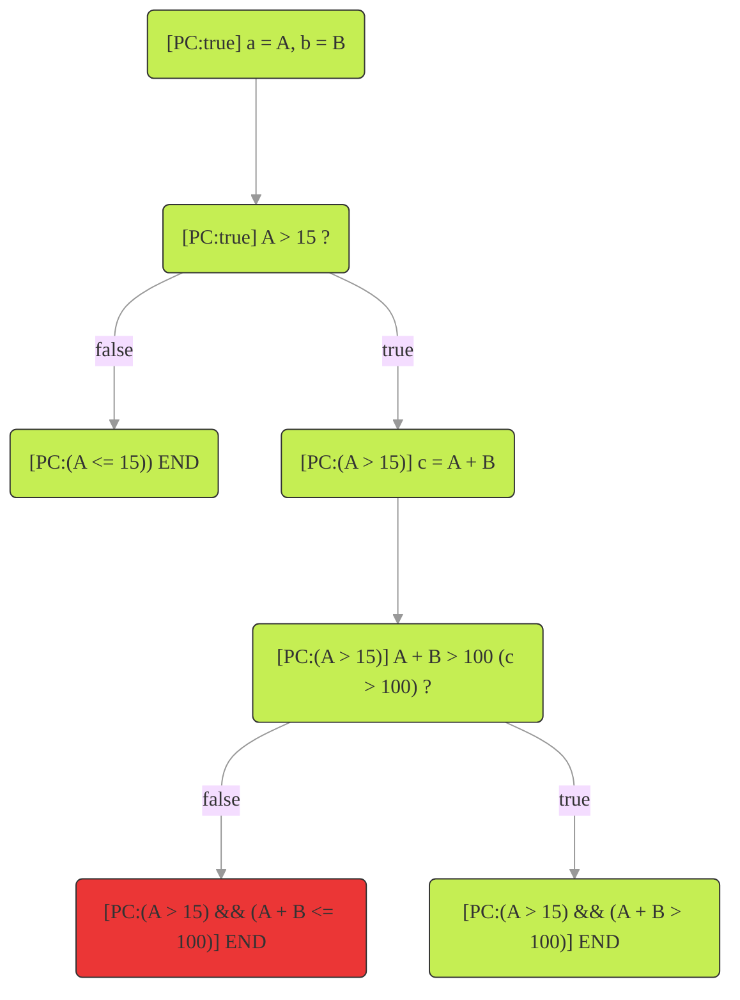

# Effective Techniques for Code Verification: A Look at Unit Testing, Fuzzing, SMT, Static Analysis, and more

This article describes unit testing, fuzzing / property testing, Satisfiable Modulo Theory (SMT), symbolic execution and static analysis. Each technique is explained by means of examples. The limitations and the therefrom following considerations are described as well. The article will also make a quick note on formal verification. At the end of the article, it is described how Byont utilizes these techniques for their report generation. The goal of this article is not to make the reader an expert in all these techniques, but to give a good understanding of what they are and how they can be used.

- [Effective Techniques for Code Verification: A Look at Unit Testing, Fuzzing, SMT, Static Analysis, and more](#effective-techniques-for-code-verification-a-look-at-unit-testing-fuzzing-smt-static-analysis-and-more)
- [0 Pre-requisites](#0-pre-requisites)
- [1 Unit testing](#1-unit-testing)
- [2 Fuzzing / property testing](#2-fuzzing--property-testing)
  - [2.1 Fuzzing with Foundry](#21-fuzzing-with-foundry)
- [3 Automated verification](#3-automated-verification)
- [4 Satisfiable Modulo Theory (SMT)](#4-satisfiable-modulo-theory-smt)
  - [4.1 Checking if the requirement can hold](#41-checking-if-the-requirement-can-hold)
  - [4.2 Checking if the requirement will always hold](#42-checking-if-the-requirement-will-always-hold)
- [5 Symbolic execution](#5-symbolic-execution)
  - [5.1 Introduction by Example](#51-introduction-by-example)
  - [5.2 Limitations](#52-limitations)
- [6 Static analysis](#6-static-analysis)
- [7 A note on formal verification](#7-a-note-on-formal-verification)
- [8 How Byont uses these techniques](#8-how-byont-uses-these-techniques)
- [9 Follow-up](#9-follow-up)
- [More resources](#more-resources)

# 0 Pre-requisites

The reader is expected to have knowledge about programming (preferably in Solidity) and a basic understanding of logic.

Blockchain, Solidity and [Foundry](https://book.getfoundry.sh/) are used for the context and examples in this article, but the analysis techniques described are not specific to these technologies.

# 1 Unit testing

First of all, unit tests. The goal of a unit test is to test that a function does what it is expected to do for a specific input. Every project should have at least some unit tests to make sure that the critical parts of the project work as expected.

However, if unit tests are not written carefully, they can miss edge cases.

Take the `payOff()` function from the code snippet below. Its expected behavior is to increase the credit of a user by a given amount. A user can have a negative credit (hence the mapping in `credit` to `int256`). The user can pay off debt (negative credit) by sending in a value (only positive and thus of type `uint256`) with the `payOff()` function.

```solidity
mapping(address => int256) credit;
/// @notice Paying off existing debt or adding credit.
/// @param amount The amount to add to the credit.
function payOff(uint256 amount) public {
    credit[msg.sender] += int256(amount);
}
...
```

At first sight, it seems just fine. However, note that a `uint256` is cast to an `int256`. Solidity uses [two's complement](https://nl.wikipedia.org/wiki/Two%27s_complement) for representing signed values. Meaning that where `uint256` has the range `[0, 2^256 - 1]`, `int256` has the range `[-2^255, -2^255 - 1]`.

So if `msg.sender` would first have a positive credit and then wants to give a future-proof boost of `2^255` (`0b100.....`), `msg.sender` would instead have a debt now of `-2^255 + original credit`. This is because of how two's complement representation works. Both `uint256` and `int256` have the same amount of bits, but these bits are interpreted differently. This is not the intended behavior of the function.

If this function would be naively tested with unit tests, a test could be created to only checks for values of `amount` that the developer expects the user to use (for example up to around 10.000). This could miss the scenario described above. The edge case described above might indeed never be triggered, but it is still a bug.

This is all to say that unit testing is good, as long as the developer created unit tests for all edge cases.

# 2 Fuzzing / property testing

Fuzzing / property testing is an improvement to single scenario unit tests. Instead of testing a single scenario, the test now needs to work for **all** possible values. The structure of the unit test might not need to change much however. The main difference is that if normally a hardcoded value would be used as the input for the function to test (for example `payOff(4)` for the function above), now a variable will be used that will be assigned a value by the fuzzer (resulting in `payOff(fuzzedAmount`). Generally a fuzzer executed multiple rounds with a newly chosen value on each round. The chosen value might triggers an edge-case that wasn't directly seen in the source code by the developer.

Both techniques (fuzzing and property testing) are similar, but the main difference is that property testing is in general a more restricted version of fuzzing where the input and output of the property test are defined in the form of a unit-test-style. Ted Kaminski (Ph.D.) wrote an [article](https://www.tedinski.com/2018/12/11/fuzzing-and-property-testing.html) about the differences. Also [this article](https://blog.nelhage.com/post/property-testing-is-fuzzing/) from Nelson Elhage describes a similar difference.

The [Foundry](https://book.getfoundry.sh/forge/fuzz-testing?highlight=fuzz#fuzz-testing) framework is a popular framework for Solidity that provides fuzzing. While they call it fuzzing, when reading the documentation they talk about property testing. Looking at the articles that discuss the difference between the two, Foundry's fuzzer indeed is more a property tester. For the rest of this article, however, the term fuzzing is used since that is also how Foundry advertises the technique.

Fuzzing can be either very simple by using a new (random) input for each new fuzz run, or more complex, by looking at the source code and previous fuzz runs to come up with the next input in order to find more bugs. Several of these fuzzing techniques are described in [this article](https://www.coalfire.com/the-coalfire-blog/fuzzing-common-tools-and-techniques?feed=blogs).

By using a fuzzer, the problem described for the `payOff()` function would likely have been found due to a fuzz parameter select being `>= 2^255`.

## 2.1 Fuzzing with Foundry

Take the code below. It's easy to get 100% branch coverage with unit tests alone, but that doesn't mean that the missing zero-check for `b` is found.

```solidity
//----------
// Code
//----------
function getAbsoluteRatio(int256 a, int256 b) external view returns (uint256 ratio){
    ratio = a / b;
    if(ratio < 0){
        ratio = -ratio;
    }
}
//----------
// Tests
//----------
//----------
// Unit tests
//
// 100% coverage with these two unit tests
function test_getAbsoluteRatio_isPositiveIfSignOfParametersAreBothPositive() public {
    int256 a = 10;
    int256 b = 5;
    uint256 ratio = getAbsoluteRatio(a, b);
    assertEq(ratio, 2, "Ratio should be 2");
}
function test_getAbsoluteRatio_isPositiveIfSignOfNumeratorIsPositiveAndNegativeOfNumerator() public {
    int256 a = 10;
    int256 b = -5;
    uint256 ratio = getAbsoluteRatio(a, b);
    assertEq(ratio, 2, "Ratio should be 2");
}
```

The following fuzz test written in Foundry would also result in 100% branch coverage, but would also find the missing zero-check for `b`. Note that this fuzz test doesn't test that it calculates the correct ratio, but only that the ratio is always positive.

Once the fuzz tests fails when `b = 0`, the missing zero-check can be added to the code by the developer. Additionally, the fuzz test can be updated to avoid `b = 0` and a new fuzz test can be added to test that `b = 0` results in a (custom) revert.

```solidity
//----------
// Fuzz test
//
// 100% coverage with this single fuzz tests,
// assuming that the fuzzer uses at least once
// an `a` and `b` with the same sign and once with
// difference signs (which every decent fuzzer should do).
function test_getAbsoluteRatio_isAlwaysPositive(int256 a, int256 b) public {
    uint256 ratio = getAbsoluteRatio(a, b);
    assertTrue(ratio >= 0);
}
```

Adding the check to avoid `b = 0` is done as follows:

```solidity
function test_getAbsoluteRatio_isAlwaysPositive(int256 a, int256 b) public {
    // Avoid division by zero
    vm.assume(b != 0);
    uint256 ratio = getAbsoluteRatio(a, b);
    assertTrue(ratio >= 0);
}
```

This shows that fuzzing can be a very powerful tool to find edge cases that are not directly visible in the source code.

# 3 Automated verification

The methods of unit testing and fuzzing requires manually written tests. This is in contrast to the automated tests described in the remaining part of this article. The automated tests use assertions present in the source code (`assert()`) and known vulnerabilities to the analysis tools to test if the source code violates any of these.

A lot of research and development has gone into automated verification tools and theories. Some of these techniques will be described in the remaining sections of this article. One thing to keep in mind is that each technique does not exclude the other. In contrary, they can be used together to make the verification process better and more efficient.

One of the techniques used as the backbone of automated verification is [Satisfiable Modulo Theory (SMT)](#4-satisfiable-modulo-theory-smt). The main purpose of SMT is to check if the variables in a program can have a certain (initial) value such that a requirement is met. In other words, if there is a **satisfiable** assignment for the variables. Sometimes this is also called the assignment for which the statement **holds**.

For example, looking only at boolean logic (`true` and `false`):

- The statement `a && ~b` (where `~` means the negation) is satisfiable by assigning `a = true; b = false`. Since `true && ~false = true && true = true`.
- But `a && ~a` is not satisfiable as it will always result in `false`. Since if `a = false`, it follows that `false && ~false = false && true = false`. Similarly, when `a = true`, it follows that `true && ~true = true && false = false`.

The SMT checker would take the statements (`a && ~b` or `a && ~a`) as the only input. Then the SMT checker will check if the statement is satisfiable, and if so, it will find a satisfying assignment for the variables.

One of the techniques that makes use of SMT is [Symbolic execution](#5-symbolic-execution) which checks all branches of a program to see if any of them lead to a failing assertion. An assertion in Solidity is indicated with the `assert()` function. If it finds a failing branch it will check if that branch can be reached using SMT. But SMT is also used during other stages in symbolic execution. For example to avoid wasting processing time on branches that can't be reached anyway.

The last technique that will be discussed in this article is [Static analysis](#6-static-analysis). Where symbolic execution 'runs' the code, static analysis 'looks' at the code (hence the name 'static'). It is mostly used to detect unwanted patterns in the code.

The remaining sections will describe these techniques in more detail.

# 4 Satisfiable Modulo Theory (SMT)

To get a better idea of what an SMT checker does, a simple example is presented. The tool [z3](https://github.com/Z3Prover/z3) is used as this is the most used SMT checker for automatic analysis tools (for Solidity).

**An online z3 runner can be used if the reader wants to run the example in their own browser:** https://microsoft.github.io/z3guide/playground/Freeform%20Editing

Please note that SMT is a generic tool and can be used for more than only software verification. The SMT solver simply tries to find a satisfiable assignment for a set of constraints (assumptions and requirements). This means that it could, for example, also be used to check if it is possible to fit a selection of shaped in a certain border without the shapes overlapping.

For the example let's say that there are the integers `a` and `b` with the following constraints:

- Assumption: `a > 15`
- Requirement: `a + b > 100`

In Solidity this could look like the code below.

```Solidity
function specialAdd(int256 a, int256 b) returns (int256 c) {
    require(a > 15, "a <= 15");
    c = a + b;
    assert(c > 100);
}
```

## 4.1 Checking if the requirement can hold

It will first be checked if the requirement (`a + b > 100`) can hold at al. Meaning that there is **at least one** satisfiable assignment for `a` and `b`. This can be done with the checks as shown below in z3.

The syntax used is [SMTLib](https://microsoft.github.io/z3guide/docs/logic/basiccommands). For this example, it is enough to know that SMTLib uses the format `(operation arg1 arg2 ... argn)`. Meaning that `(+ a b)` represents `a + b`.

First, the variables `a` and `b` are declared using `declare-const`, then the constraints are declared using `(assert ...)`. After this, it is checked if the constraints can be satisfied with `(check-sat)` and get an example assignment with `(get-model)`.

```smt-lib
(declare-const a Int)
(declare-const b Int)
(assert (> a 15))
(assert (> (+ a b) 100))
(check-sat)
(get-model)
```

Running the code above in the online tool results in the following output seen below.

```sat
(
  (define-fun b () Int
    85)
  (define-fun a () Int
    16)
)
```

This says that if `a = 16` and `b = 85`, that all constraints are met (which is true since `16 > 15 and 16 + 85 = 101 > 100`).

However, now it is only proven that it is possible to meet the criteria. It is not known yet if `a + b` is always `> 100` while `a > 15`. This approach can be compared to testing only the happy flow when writing unit tests. It needs to be checked if the requirement can be violated instead.

## 4.2 Checking if the requirement will always hold

To check if the requirement always holds, the **negation** of the requirement needs to be asserted. This checks if `a + b` can ever be `<= 100` while `a > 15`. If such an assignment can be found (thus if the set of constraints is satisfiable), it means that the assertion can be violated.

The only change in the code is that `(not ...)` is put around the requirement.

```smt-lib
(declare-const a Int)
(declare-const b Int)
(assert (> a 15))
(assert (not (> (+ a b) 100)))
(check-sat)
(get-model)
```

This code results in the following output.

```
sat
(
  (define-fun b () Int
    84)
  (define-fun a () Int
    16)
)
```

This says that the negation of the requirement can be satisfied. Meaning that the requirement is not met. A counter-example to the requirement is given as `a = 16` and `b = 84`, resulting in `a > 15 and 16 + 84 = 100 <= 100`. The requirement is indeed violated while the assumption is still met.

This example showed that SMT tools can be used to check if logical requirements can be violated and that they can give a counter-example if it is violated.

After learning that the requirement can be violated, it could be decided that the assumption `b >= 85` is needed (or in Solidity `require(b >= 85, "b < 85")`).

Translating this to SMTLib, the code would look like the following.

```smt-lib
(declare-const a Int)
(declare-const b Int)
(assert (> a 15))
(assert (>= b 85))
(assert (not (> (+ a b) 100)))
(check-sat)
```

Resulting is the following output.

```
unsat
```

This says that the set of constraints is not satisfiable and thus that the requirement can not be violated while the assumptions are met.

Note that the code above doesn't have `(get-model)`, simply because the model can't be satisfied.

For more complex systems, another tool would normally generate these sets of constraints since it can become quite complex. More often SMT is part of higher level tooling like **symbolic execution**.

# 5 Symbolic execution

## 5.1 Introduction by Example

Consider the function `specialAdd()` from the SMT example.

First, let's make the difference between **concrete execution** and **symbolic execution** clear.

- **Concrete execution:** the parameters `a` and `b` to `specialAdd()` would be assigned actual values (like `45` and `13`). The variable `c` would be a concrete value (the result of `a + b`, for example, `45 + 13 = 58`), and the function would **either** fail the `assert()` or not (in this example it would fail due to `58 <= 100`).
- **Symbolic execution:** the execution assigns the parameter `a` the symbolic value `A` and assigns to `b` the symbolic value `B`. The variable `c` would now be assigned the symbolic value `A + B`. This can't be simplified due to `A` and `B` being symbolic. Since the operation `c > 100` (which is actually `A + B > 100`) is an if-statement in disguise, the symbolic executor will 'take' both branches. One of these branches will have the failing assert. The symbolic executor would now first check if this branch is reachable. If it is, it can find a concrete counter-example using SMT.

During symbolic execution, a Path Condition (`PC`) is kept track of. Every time that a branch is taken, the condition that is `true` to take that path (so the condition of the if-statement) is added to the `PC`. In the beginning, there is only one 'branch' and thus initially `PC:true` holds.



As mentioned in the SMT section, SMT is used in symbolic execution. It does this in multiple places. It is used during the symbolic execution to check if a path is still of interest (and thus needs to be kept in memory) or if it can be pruned (removed from memory to save on computation and memory). In this example, the first false branch with `[PC:(A <= 15)]` that represents the failing `require()` is not of interest and can be pruned. It is not of interest because nothing has been written to storage at this time.

The path of the failing assert, however, is of interest. As mentioned above, it first needs to be determined if the path is reachable. If so, it will find a concrete counter-example. The `PC` for the failing branch is `(A > 15) && (A + B <= 100)`. These are the exact constraints that were used in the SMT example, so it is already known that this `PC` can be satisfied if `A = 16` and `B = 84`. Since the failing assert can be reached, its also know that an extra `require(b >= 85)` is needed to make sure that this `PC` becomes unsatisfiable.

## 5.2 Limitations

The `specialAdd()` function is of course a really simple function. It doesn't interact with state variables, it doesn't call other local functions, and also doesn't call external functions.

It gets more interesting when these things do happen. If a local function is called, there isn't really a problem yet. Since calling a local function is similar to a jump instruction. But what if this function is recursive (unlikely in a smart contract, but possible)? Or what if the function is self-containing (like `specialAdd()`) but it makes use of a loop of which the loop bound is determined by an argument to the function?

Most of these problems come down to the state-space-explosion problem. Meaning that there are simply too many possible paths (and thus states) in the program to cover them all. It would simply take too many resources and execution time.

The state-space can blow up quite quickly. Consider the function `getAgeCategory()` below.

```Solidity
enum AGE_CATEGORY { BABY, CHILD, TEEN, ADULT, SENIOR }
uint256 numberOfChildren;
function getAgeCategory(uint256[] memory age) external returns (AGE_CATAGORY[] memory catagories) {
    uint256 _numberOfChildren = 0;
    for(uint256 i = 0; i < age.length; i++) {
        if (age[i] < 1) {
            catagories[i] = AGE_CATEGORY.BABY;
        } else if (age[i] < 13) {
            catagories[i] = AGE_CATEGORY.CHILD;
            _numberOfChildren++;
        } else if (age[i] < 20) {
            catagories[i] = AGE_CATEGORY.TEEN;
        } else if (age[i] < 65) {
            catagories[i] = AGE_CATEGORY.ADULT;
        } else {
            catagories[i] = AGE_CATEGORY.SENIOR;
        }
    }
    numberOfChildren = _numberOfChildren;
}
```

For each item in the age array, it will return the corresponding age category. This is a simple example, but it already has a state-space of `5^(age.length)`. This is a lot of states to cover. For a family of four persons (for example two children and two parents) there would already be 5^4 = 625 states to cover. For a classroom of 25 students this would be 5^25 = 298.023.223.876.953.125 states to cover. This also shows why symbolic execution (and similar methods) use so much memory.

One of the things that is done to reduce the state-space and resource usage is to prune uninteresting paths. Meaning that paths that, for example, do not change the state of the contract, can be removed from the analysis. This reduces the memory usage and lowers the analysis time by not needing to process these paths further.

The state-space-explosion problem means that the symbolic execution has to have some trade-offs. For example, only looping up to a certain amount when dealing with parameter-determined loop bounds. Or to stop after 'n' amount of transactions.

What if the function calls an external function of an interface and the source code is not known? In this case, the tool could simply return a random value, or it could simply give up and say that symbolic execution is not possible in this case. But this of course ignores the possibility that the external call makes a change in the state variables of the original contract which can influence the flow for the rest of the original function. Or something in between.

# 6 Static analysis

So far SMT, symbolic execution and fuzzing have been discussed as tools that help to find more bugs than with unit tests alone. These are all analysis tools that check the source code against assertions/requirements that the code should adhere to by running the code. Static analysis is different in that it doesn't run the code, but it looks at the code and tries to find patterns that are known to be problematic.

For example, [Prettier](https://prettier.io/) (the code formatter) is also a static analysis tool. It looks at your code and finds violations of rules defined in the configuration of prettier. Also [Grammarly](https://app.grammarly.com/) can be thought of as a static analysis tool. It looks at your text and finds violations of rules defined by the English language.

More generally, the goal of static analysis tools is to find patterns in the code that are not conforming to a certain standard, or that are known to have a high chance of leading to a bug in the code. Another thing is that it could, for example, find dead code by looking at where functions and variables are used in the code.

For Solidity, one such pattern is for example updating a variable after an external call. This is a classic setup for re-entrancy attacks.

Static analysis can also be used to help reduce the state-space-explosion problem. This is because static analysis analyses the source code and sees dependencies between variables and function. This gained insight can then be used to decide to not symbolically execute certain branches. Meaning that branches that are not updating state variables of the contract can be pruned earlier.

For Solidity specifically, this was presented in the [paper for MPro](https://arxiv.org/pdf/1911.00570.pdf). MPro improved the symbolic execution tool for Solidity called [Mythril](https://github.com/ConsenSys/mythril/tree/develop) with the static analysis tool for Solidity called [Slither](https://github.com/crytic/slither).

# 7 A note on formal verification

SMT (Satisfiability Modulo Theories) and symbolic execution are both techniques used in formal verification, but it is important to consider their physical limitations, such as memory consumption and execution time. These techniques can verify that the assertions (requirements) specified in your program are met within the given configuration for the tools, but there are potential limitations to this process. For example, if an assertion could potentially be violated after n steps, but the configuration only allows for n-1 steps in order to reduce the state-space, the violation may not be detected. Additionally, the tools used for formal verification can only verify what they are given, so if the assertion does not accurately cover the associated requirement in the functional design, the assertion may not be violated even though the assertion itself is incorrect, leading to a false impression of success. It is important to carefully consider these limitations and properly configure the tools to ensure a thorough and effective verification process.

# 8 How Byont uses these techniques

Byont makes heavy use of Foundry's fuzzing capabilities. Besides that, the following tools are used:

- [Slither](https://github.com/crytic/slither) (static-analysis)
- solc's [SMTChecker](https://docs.soliditylang.org/en/v0.8.17/smtchecker.html) and [Mythril](https://github.com/ConsenSys/mythril/tree/develop) (symbolic execution)
- [KEVM](https://github.com/runtimeverification/evm-semantics) (symbolic execution and more).

How these tools work in detail will be discussed in a later article.

Byont is currently in the process of improving the integration of these tools in its smart contract development flow.

It is important to use multiple tools since none of them will find all problems on their own. This is not because the tools are not good enough. It's just that their methods of implementing the analysis techniques can focus on different aspects. A survey that compared 27 analysis tools can be found in this [paper](https://www.researchgate.net/publication/334786201_A_Survey_of_Tools_for_Analyzing_Ethereum_Smart_Contracts).

That's why analyzing and combining the results is the best option. This is also the goal of Byont's [smart-contract-analysis-tools](https://github.com/Byont-Ventures/smart-contract-analysis-tools) project.

Byont's [smart-contract-analysis-tools](https://github.com/Byont-Ventures/smart-contract-analysis-tools) project aims to be easily integratable into the development flow. After the execution of the tool, a report is generated highlighting the potential problems in your contract(s) and giving potential solutions.

The report will be mostly agnostic to the used tools. A developer wants to know what the problems are and that false positives (detected errors that aren't real errors) are filtered out. This can only be done by analyzing the result of multiple tools in combination with the source code itself.

At Byont, we provide all of our customers with a report detailing the testing methods and results of the product development process.

# 9 Follow-up

In the next article, it will be demonstrated how Byont's tool can be used with real-life examples.

# More resources

- [Ethereum Formal Verification Blog](https://fv.ethereum.org/)
- [Formal Systems Laboratory](https://fsl.cs.illinois.edu/)
- [A list of formal verification tools for ethereum](https://github.com/leonardoalt/ethereum_formal_verification_overview)
- [SWC registry](https://swcregistry.io/)
- [Smart contract vulnerabilities](https://hacken.io/discover/smart-contract-vulnerabilities/)
- [Ted Kaminski about fuzzing and property testing](https://www.tedinski.com/2018/12/11/fuzzing-and-property-testing.html)
- [Nelson Elhage about fuzzing and property testing](https://blog.nelhage.com/post/property-testing-is-fuzzing/)
- [Fuzzing techniques](https://www.coalfire.com/the-coalfire-blog/fuzzing-common-tools-and-techniques?feed=blogs)
- [Paper for MPro](https://arxiv.org/pdf/1911.00570.pdf)
- [Smart-contract verification in NuSMV](https://hal.archives-ouvertes.fr/hal-02103511/document)
- [Temporal logic](https://wickstrom.tech/programming/2021/05/03/specifying-state-machines-with-temporal-logic.html)
- [Verifying LTL Properties of Bytecode with Symbolic Execution](https://www.fit.vutbr.cz/research/groups/verifit/tools/muse/bytecode08.pdf)
- [Analysis tool survey](https://www.researchgate.net/publication/334786201_A_Survey_of_Tools_for_Analyzing_Ethereum_Smart_Contracts)
- [smart-contract-analysis-tools](https://github.com/Byont-Ventures/smart-contract-analysis-tools)
