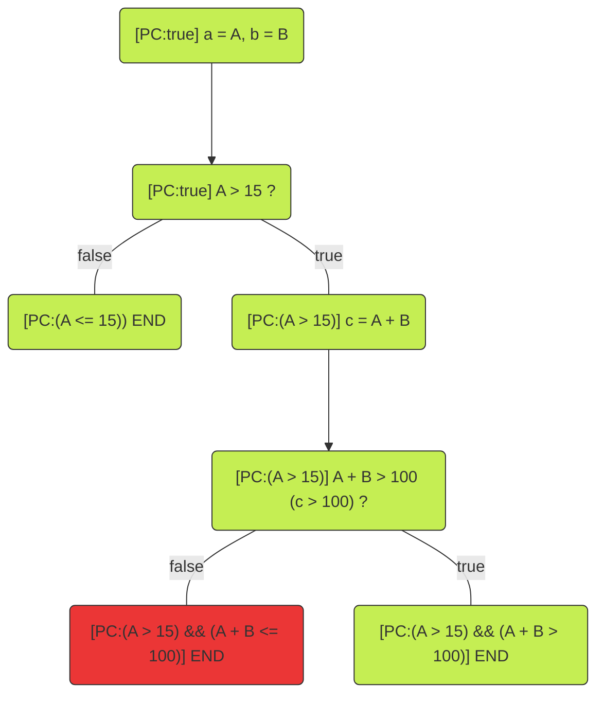

# Analysis techniques

- [Analysis techniques](#analysis-techniques)
  - [Unit testing](#unit-testing)
  - [Fuzzing (property testing)](#fuzzing-property-testing)
  - [Can we do better?](#can-we-do-better)
  - [Automated testing](#automated-testing)
  - [Satisfiable Modulo Theory (SMT)](#satisfiable-modulo-theory-smt)
    - [Checking if the requirement can hold](#checking-if-the-requirement-can-hold)
    - [Checking if the requirement will always hold](#checking-if-the-requirement-will-always-hold)
  - [Symbolic execution](#symbolic-execution)
    - [Introduction by example](#introduction-by-example)
    - [Limitations](#limitations)
    - [Symbolic executions tools for Solidity](#symbolic-executions-tools-for-solidity)
  - [Static analysis](#static-analysis)
    - [Static analysis tools for Solidity](#static-analysis-tools-for-solidity)
  - [How Byont uses these techniques](#how-byont-uses-these-techniques)
  - [More sources](#more-sources)

## Unit testing

Every developer writes unit-tests for there code (right?). The goal of such a unit test is to test that a single function does what it is expected to do. Or, depending on the usage, testing that a certain function calls other function to perform a local integration test. Sounds easy enough.

Let's have a simple function as seen below:

```solidity
mapping(address => int256) credit;

/// @notice Paying off existing dept, or adding credit.
/// @param amount The amount to add to the credit.
function payOff(uint256 amount) public {
    credit[msg.sender] += int256(amount);
}
```

On first sight it seems just fine. However, not that an `uint256` is casted to an `int256`. Solidity uses [two's complement](https://nl.wikipedia.org/wiki/Two%27s_complement) for representing negative values. Meaning that where `uint256` has the range [0, $2^{256} - 1$], `int256` has the range [$-2^{255}$, $-2^{255} - 1$].

So if `msg.sender` would first have a positive credit and then wants to give a future-proof boost of $2^{255}$ (`0b100.....`), `msg.sender` would instead have a debt now of $-2^{255} + \text{original credit}$. Oops...

A simple fix would be to add `require(amount <= uint256(type(int256).max), "Amount too large");`. Assuming that an up-to-date solc version is used that checks for overflows.

If this function could be naively tested, a test could be created to only check for valid values of `amount`. This would miss the scenario described above.

## Fuzzing (property testing)

Another technique is to using fuzzing on your unit tests. Fuzzing is also called property-testing. This is because instead of testing a single scenario, your test now needs to work for **all** possible values (in the range of the type of course). So now you really need to think of what the behavior is instead of what the result should be. The [Foundry](https://book.getfoundry.sh/forge/fuzz-testing?highlight=fuzz#fuzz-testing) framework has this built-in.

Fuzzing, however, still is only running unit-tests. But depending on the quality of the fuzzer, the problems described for the `payOff()` function would likely have been found due to a fuzz parameter being `>= 2^255`.

## Can we do better?

Unit-testing and fuzzing are great. But they require you to write tests. A lot of tests if you want to have a high coverage of all the possible paths. The more unit-tests you have, the easier it is to do a refactor with confidence. Great! The downside is that a refactor likely also requires some of the tests to be refactored. Not so great!

Unit-tests and fuzzing are needed. No doubt about that. But we could try to make our lives easier by also making use of automated testers and scanners.

## Automated testing

A lot of research and development has gone into automated testing and verification tools. What these tools have in common is that they get the source code (preferably with a lot of `assert()` statements to know what to look for) and look if certain failing asserts can be reached or is code-smells can be found.

Note that the the term 'source code' was used here. This can either the be actual source code or the compiled bytecode. The reason for pointing this out if because there are also non-automated verification techniques. For these techniques the user has to define a model of how to design works (the design, not the code). Additionally, properties on this design have to be defined. The verification tooling will then take the model and the properties and checks if they can be satisfied.

What you will notice when diving more into these different (non-)automated tooling is that there will always be a bit of both, while there are clear differences between techniques and tooling, there is also quite some overlap.

One of the techniques used as the backbone of both non-automated and automated technique is [Satisfiable Modulo Theory (SMT)](#satisfiable-modulo-theory-smt). The main purpose of SMT is to check if the variables in a program can have a certain (initial) value such that a requirement is met. In other words, if there is a **satisfiable** assignment for the variables.

A technique that uses SMT is [Symbolic execution](#symbolic-execution) that checks all branches of a program to see if any of them lead to a failing assertions. If it finds a failing branch it will check if that branch can be reached using SMT. But SMT is also used during other stages in symbolic execution. For example to avoid wasting processing time on branches that can't be reached anyway. In other words to prune (remove) these branches from the analysis process.

---

## Satisfiable Modulo Theory (SMT)

To get a better idea of what an SMT checker does, we will go over a simple example. We will use [z3](https://github.com/Z3Prover/z3) as this is the most used SMT checker for automatic analysis tools (for Solidity).

An online z3 runner can be used if you want to try the examples yourself: https://microsoft.github.io/z3guide/playground/Freeform%20Editing

Please note that SMT is a general tool and can be used for more that only software languages. The SMT solver simply tries to find a satisfiable assignment for a set of constraints (assumptions and requirements).

For the example lets say that we have integers `a` and `b` with the following constraints:

- Assumption: `a > 15`
- Requirement: `a + b > 100`

In Solidity this could look like the code below.

Note that the assumptions and requirements can originate from knowledge about the system in which the function is used, while the function itself doesn't have this knowledge explicitly. The the function might be fine when using in the system, but not when using as a self-containing function.

```Solidity
function specialAdd(int256 a, int256 b) returns (int256 c) {
    require(a > 15, "a <= 15");

    c = a + b;

    assert(c > 100);
}
```

### Checking if the requirement can hold

We can first check if the requirement (`a + b > 100`) can hold at al. This can be done with the checks as shown below in z3. The syntax used is [SMTLib](https://microsoft.github.io/z3guide/docs/logic/basiccommands). For this example it is enough to know that SMTLib uses the format `(operation arg1 arg2 ... argn)`. Meaning that `(+ a b)` represents `a + b`.

It is important to note that here we only check that there is **at least one** assignment for `a` and `b` that makes sure that `a + b > 100`.

First we introduce the values `a` and `b` using `declare-const`, then we describe the constraints using `assert`. After this, we check if the constraints can be satisfied with `(check-sat)` and get an example assignment with `(get-model)`.

```z3
(declare-const a Int)
(declare-const b Int)

(assert (> a 15))
(assert (> (+ a b) 100))

(check-sat)
(get-model)
```

Running this in the online tool results in the following output. Saying that if `a = 16` and `b = 85` that all constraints are met (which is true since `16 + 85 = 101 > 100`).

```
sat
(
  (define-fun b () Int
    85)
  (define-fun a () Int
    16)
)
```

However, now we only know that it is possible. We don't know yet if `a + b` is always more than 100. This approach can be compared to testing only the happy-flow when writing unit-tests. We need to check if the requirement can be violated instead.

### Checking if the requirement will always hold

To check if our requirement always holds we will check for the **negation** of our requirement. Meaning that we are checking if the requirement can be violated. The only change is that we put `(not ...)` around our requirement.

```z3
(declare-const a Int)
(declare-const b Int)

(assert (> a 15))
(assert (not (> (+ a b) 100)))

(check-sat)
(get-model)
```

Resulting in the following output. This says that the negation of our requirement can be satisfied. Meaning that the requirement is not met. A counter-example to our requirement is given as `a = 16` and `b = 84` resulting in `16 + 84 = 100 <= 100`. The requirement is indeed violated.

```
sat
(
  (define-fun b () Int
    84)
  (define-fun a () Int
    16)
)
```

This example showed that SMT tools can be used to check if logical requirements can be violated and that they can give a counter-example if it is violated.

For more complex systems you would generally not write these rules in z3 manually, but instead, generate them using a higher-level tool. More often SMT is part of more advanced tooling like **symbolic execution**. The example below which describe this.

---

## Symbolic execution

### Introduction by example

Consider the function `specialAdd()` from the SMT example.

First, let's make the difference between **concrete execution** and **symbolic execution** clear.

- **Concrete execution:** the parameters `a` and `b` to `specialAdd()` would be assigned actual values (like `45` and `13`). The variable `c` would be a concrete value (the result of `a + b`, for example `45 + 13 = 58`) and the function would **either** fail the `assert()` or not (in this example it would fail due to `58 <= 100`).
- **Symbolic execution:** the execution assigns the parameter `a` the symbolic value `A` and assigns to `b` the symbolic value `B`. The variable `c` would now be assigned the symbolic value `A + B`. This can't be simplified due to `A` and `B` being symbolic. Since the operation `c > 100` (which is actually `A + B > 100`) is an if-statement in disguise, the symbolic executor will 'take' both branches. One of these branches will have the failing assert. The symbolic executor would now first check if this branch path is reachable. If it is, it can find a concrete counter-example.

During symbolic execution a Path Condition (`PC`) is being kept track of. Every time that a branch is taken, the condition to take that path (so the condition of the if-statement) is added to the `PC`. In the beginning there is only one branch and thus initially `PC:true` holds.



As mentioned in the SMT section, SMT is used in symbolic execution. It does this is multiple places. It is used during the symbolic execution to check if a path is still of interest (and this needs to be kept in memory) or if it can be pruned (removed from memory to save on computation and memory). In this example the first false branch with `[PC:(A <= 15)]` that represents the failing `require()` is not of interest as nothing is written to storage and can be pruned.

The path of the failing assert, however, is of interest. As mentioned above, it first needs to be determined if the path is reachable. If so, it will find a concrete counter-example. The `PC` for the failing branch is `(A > 15) && (A + B <= 100)`. This are the excact contraints that we used in the SMT example, so we already know that this `PC` can be satisfied if `A = 16` and `B = 84`. Since the failing assert can be reached, we know that an extra `require()` is needed to make sure that this `PC` becomes unsatisfiable.

### Limitations

The `specialAdd()` function is of course a really simple function. It doesn't interact with state variables, it doesn't call other local function, and also doesn't call external functions.

It gets more interesting when these things do happen. If a local function is called it can still be relatively easy to make this function inline. But what if this function is recursive (unlikely in a smart-contract, but possible)? Or what if the function is self-containing (like `specialAdd()`) but it makes use of a loop of which the loop bound it determined by an argument to the function. Or what if the function calls an external function of an interface and we don't have the code of the implementation?

This means that we the symbolic execution has to have some trade-offs. For example only looping up to a certain amount when dealing with parameter-determined loop bounds. When an external call is done of which we don't have the code, the tool could simply return a random value (in the domain of the return type of the external call), or it could simply give up and return. But this of course ignores the possibility that the external call makes a change in the state variables of the original contract which can influence the flow for the rest of the original function.

Note that these limitations have to do with the symbolic execution. Not with SMT. SMT is simply the tools to help with (logical) constraints.

### Symbolic executions tools for Solidity

There are multiple existing tools that perform symbolic execution such as:

- [Mythril](https://github.com/ConsenSys/mythril)
- [hevm](https://github.com/ethereum/hevm)
- [Manticore](https://github.com/trailofbits/manticore)
- [KEVM](https://github.com/runtimeverification/evm-semantics)

Each tool will deal in a different way to the above mentioned limiations. Mythril will for example report [SWC-107](https://swcregistry.io/docs/SWC-107) re-entrancy [original Mythrils docs](https://github.com/muellerberndt/smashing-smart-contracts/blob/master/smashing-smart-contracts-1of1.pdf).

The original Mythril docs state the following on page (43):

> The following is Mythril's strategy for detecting potential re-entrancy
> bugs:
>
> 1. Detect all message calls to user-supplied addresses that also forward
>    gas. Note that Solidity's send() and transfer() functions set call gas
>    to only 2,300; this setting prevents re-entrancy attacks.
> 2. If an external call to an untrusted address is detected, analyze the
>    control flow graph for possible state changes that occur after the
>    call returns. Generate a warning if a state change is detected.

## Static analysis

Whereas symbolic execution 'runs' the code, static analyses only look at the code. This doesn't mean that static analysis tools are less powerful or less useful. But it does mean that, in general, they will finish quicker than symbolic execution.

The main goal of static analysis tools is to find patterns in the code that are not conforming to a certain standard, or that are known to have a high change of contributing to a bug in the code.

For Solidity one such pattern is for example updating a variable, used to check if an external call has to be called, only after the external call. This is a classic setup for re-entrancy attacks.

But [Prettier](https://prettier.io/) (the code formatter) is also a static analysis tool. It looks at your code and finds violations of rules defined in the configuration of prettier.

### Static analysis tools for Solidity

There are multiple existing tools that perform static analysis such as:

- [Slither](https://github.com/crytic/slither)
- [remix-analyzer](https://github.com/ethereum/remix-project/tree/master/libs/remix-analyzer#how-to-use)

## How Byont uses these techniques

At Byont we make heavy use of Foundry's fuzzing capabilities. Besides that, we are also making use of Slither, solc's SMTChecker, Mythril and KEVM. It is important to use multiple tools, since none of them will find all problems on its own. This is not because the tools are not good enough (because they are good). It's just that their methods of implementing the analysis techniques can focus on different aspects.

That's why analyzing and combining the results is the best option. This is also the goal of our [smart-contract-analysis-tools](https://github.com/Byont-Ventures/smart-contract-analysis-tools) project.

It would of course be super interesting to create our own symbolic execution or static analysis tool, but that would be a fool's errand and would undermine the tremendous effort and research that has gone into the existing tools and theories.

Therefore we will gratefully make use of the existing tools and add value by analyzing the results of the tools to get a more complete report.

This project aims for be easily integrated into your own solidity project. After execution our tool, you will receive a report highlighting the potential problems in your contract(s) and giving potential solutions.

<!-- ## Constraint Horn Clauses (CHC)

A set of CHC described the program with logic. It still uses an SMT checker as the backend.

For more information see https://www.cs.fsu.edu/~grigory/hornspec.pdf with the related presentation https://www.youtube.com/watch?v=kbtnye_q3PA.

## Matching logic

Docs: http://www.matching-logic.org/

Matching logic is used as the backbone of the K-framework on which KEVM is built.

## Verifying source code vs bytecode

The main benefit of working with bytecode is that you are working with the code which will be deployed. You are not dependent on potential errors in the compiler. -->

## More sources

- [Ethereum Formal Verification Blog](https://fv.ethereum.org/)
- [Formal Systems Laboratory](https://fsl.cs.illinois.edu/)
- [A list of formal verification tools for ethereum](https://github.com/leonardoalt/ethereum_formal_verification_overview)
- [Smart contract vulnerabilities](https://hacken.io/discover/smart-contract-vulnerabilities/)
<!-- - [asd](https://arxiv.org/pdf/1911.00570.pdf) -->
