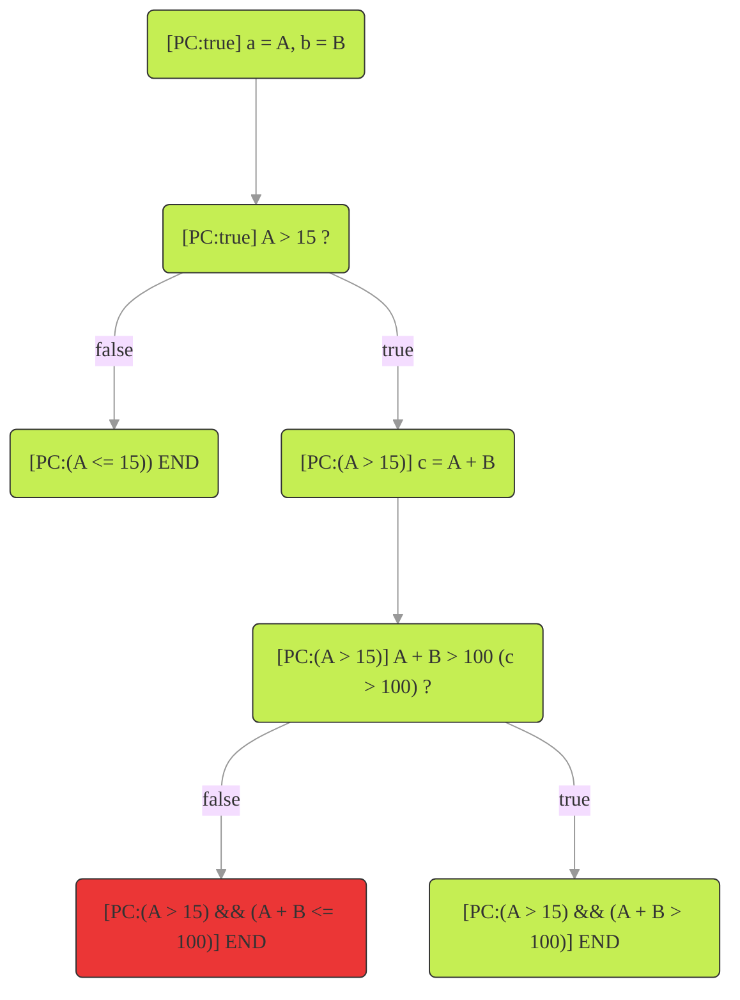

# Analysis techniques of software

This article describes several techniques such as fuzzing (property testing), symbolic execution, static analysis, and Satisfiability Modulo Theory (SMT) that can be used as an addition to the more standard unit testing. It is also described how these techniques are working together and how that benefits their performance. Each technique is explained by means of examples. The limitations and the therefrom following considerations are described as well. The article will also make a quick note on formal verification. At the end of the article, it is described how Byont utilizes these techniques for their report generation.

The reader is expected to have knowledge about programming in Solidity and a basic understanding of logic.

The layout is as follows:

- [1 Unit testing](#1-unit-testing)
- [2 Fuzzing (property testing)](#2-fuzzing-property-testing)
- [3 Can we do better?](#3-can-we-do-better)
- [4 Automated and semi-automated testing](#4-automated-and-semi-automated-testing)
- [5 Satisfiable Modulo Theory (SMT)](#5-satisfiable-modulo-theory-smt)
  - [5.1 Checking if the requirement can hold](#51-checking-if-the-requirement-can-hold)
  - [5.2 Checking if the requirement will always hold](#52-checking-if-the-requirement-will-always-hold)
- [6 Symbolic execution](#6-symbolic-execution)
  - [6.1 Introduction by Example](#61-introduction-by-example)
  - [6.2 Limitations](#62-limitations)
- [7 Static analysis](#7-static-analysis)
- [8 A note of formal verification](#8-a-note-of-formal-verification)
- [9 How Byont uses these techniques](#9-how-byont-uses-these-techniques)
- [10 Follow-up](#10-follow-up)
- [More resources](#more-resources)

## 1 Unit testing

The goal of a unit tests is to test that a function does what it is expected to do.

Take the `payOff()` function from the code snippet below. Its expected behavior is to increase the credit of a user by a given amount. A user can have a negative credit (hence the mapping in `credit` to `int256`). The user can pay off debt (negative credit) by sending in a value (only positive and thus of type `uint256`) with the `payOff()` function.

```solidity
mapping(address => int256) credit;

/// @notice Paying off existing debt or adding credit.
/// @param amount The amount to add to the credit.
function payOff(uint256 amount) public {
    credit[msg.sender] += int256(amount);
}

...
```

At first sight, it seems just fine. However, note that a `uint256` is cast to an `int256`. Solidity uses [two's complement](https://nl.wikipedia.org/wiki/Two%27s_complement) for representing negative values. Meaning that where `uint256` has the range `[0, 2^256 - 1]`, `int256` has the range `[-2^255, -2^255 - 1]`.

So if `msg.sender` would first have a positive credit and then wants to give a future-proof boost of `2^255` (`0b100.....`), `msg.sender` would instead have a debt now of `-2^255 + original credit`. This is because of how two's complement representation works`. This is not the intended behavior of the function.

If this function would be naively tested with unit tests, a test could be created to only checks for values of `amount` that the developer expects the user to use. This could miss the scenario described above.

This is all to say that unit testing is good, as long as the developer created unit tests for all edge cases.

## 2 Fuzzing / property testing

Fuzzing / property testing is an improvement to single scenario unit tests. Instead of testing a single scenario, your test now needs to work for **all** possible values (in the range of the input type of course). The structure of the unit test might not need to change much. The main difference is that if normally a hardcoded value would be used as the input for the function to test (for example `payOff(4)` for the function above), now a variable will be used that will be assigned a value by the fuzzer (resulting in `payOff(fuzzedAmount`). This might use an input value that triggers an edge-case that wasn't directly seen in the source code by the developer.

Both techniques are similar, but the main difference is that property testing is in general a more restricted version of fuzzing where the input and output of the property test are well defined. Ted Kaminski (Ph.D.) wrote an [article](https://www.tedinski.com/2018/12/11/fuzzing-and-property-testing.html) about the differences. Also [this article](https://blog.nelhage.com/post/property-testing-is-fuzzing/) from Nelson Elhage describes a similar difference.

The [Foundry](https://book.getfoundry.sh/forge/fuzz-testing?highlight=fuzz#fuzz-testing) framework is a popular framework that provides fuzzing. While they call it fuzzing, when reading the their actual documentation they talk about property testing. And Foundry's fuzz testing is actually just property-testing. For the rest of this article however, the term fuzzing is used since that is also how Foundry advertises its technique.

Fuzzing can be either very simple by using a new (random) input for each new fuzz run, or more complex, by looking at the source code and previous fuzz runs to come up with the next input. Several fuzz techniques are described in [this article](https://www.coalfire.com/the-coalfire-blog/fuzzing-common-tools-and-techniques?feed=blogs).

By using a fuzzer, the problem described for the `payOff()` function would likely have been found due to a fuzz parameter being `>= 2^255`.

## 3 Can we do better?

Unit testing and fuzzing are great. But they require you to write tests. A lot of tests if you want to have high coverage of all the possible paths. The more unit tests you have, the easier it is to do a refactor with confidence. Great! The downside is that a refactor likely also require some of the tests to be refactored. Not so great!

Unit tests and fuzzing are needed. No doubt about that. But we could try to make our lives easier by also making use of automated testers and scanners.

## 4 Automated and semi-automated testing

A lot of research and development has gone into automated testing and verification tools. What these tools have in common is that they get the source code (preferably with a lot of `assert()` statements to know what to look for) and look if certain failing asserts can be reached or if code-smells can be found.

The term "source code" refers to the human-readable code that is written by a programmer and is then compiled into machine-readable code (also known as bytecode). However, there are also semi-automated verification techniques that do not require access to the source code. Instead, these techniques rely on a functional design of the project, which outlines how the project should behave.

For example, in the case of a staking contract, the functional design might specify that users can only increase or decrease their stake once per month, and that the admin can change the interval during which users are allowed to modify their stake. These actions can be translated into a state machine, and the requirements can be formalized using logic. By providing both the state machine and the formalized requirements to a verification tool, it can attempt to create a mathematical proof that the requirements can be satisfied.

If the tool finds that a requirement is not satisfied (e.g., if it discovers that a user can change their stake if the admin lowers the minimum interval), this indicates that the functional design and requirements must be updated. In this case, the requirements might need to be revised to specify that users cannot update their stake for the minimum interval set by the admin.

What you will notice when diving more into the different (semi-)automated tooling is that there will always be a mix of different techniques.

One of the techniques used as the backbone of both semi-automated and automated techniques is [Satisfiable Modulo Theory (SMT)](#5-satisfiable-modulo-theory-smt). The main purpose of SMT is to check if the variables in a program can have a certain (initial) value such that a requirement is met. In other words, if there is a **satisfiable** assignment for the variables.

For example, when looking only at boolean logic, the statement `a && ~b` (where `~` means the negation) is satisfiable by assigning `a = true; b = false`. But `a && ~a` is not satisfiable as is will always result in `false`.

A technique that uses SMT is [Symbolic execution](#6-symbolic-execution) which checks all branches of a program to see if any of them lead to a failing assertion. An assertion in Solidity is indicated with the `assert()` function. If it finds a failing branch it will check if that branch can be reached using SMT. But SMT is also used during other stages in symbolic execution. For example to avoid wasting processing time on branches that can't be reached anyway. In other words to prune (remove) these branches from the analysis process.

---

## 5 Satisfiable Modulo Theory (SMT)

To get a better idea of what an SMT checker does, we will go over a simple example. We will use [z3](https://github.com/Z3Prover/z3) as this is the most used SMT checker for automatic analysis tools (for Solidity).

**An online z3 runner can be used if you want to try the examples yourself:** https://microsoft.github.io/z3guide/playground/Freeform%20Editing

Please note that SMT is a general tool and can be used for more than only software languages. The SMT solver simply tries to find a satisfiable assignment for a set of constraints (assumptions and requirements).

For the example let's say that we have integers `a` and `b` with the following constraints:

- Assumption: `a > 15`
- Requirement: `a + b > 100`

In Solidity this could look like the code below.

Note that the assumptions and requirements can originate from knowledge about the system in which the function is used, while the function itself doesn't have this knowledge explicitly. The function might be fine when used in the system, but not when used as a self-containing function.

```Solidity
function specialAdd(int256 a, int256 b) returns (int256 c) {
    require(a > 15, "a <= 15");

    c = a + b;

    assert(c > 100);
}
```

### 5.1 Checking if the requirement can hold

We can first check if the requirement (`a + b > 100`) can hold at al. This can be done with the checks as shown below in z3. The syntax used is [SMTLib](https://microsoft.github.io/z3guide/docs/logic/basiccommands). For this example, it is enough to know that SMTLib uses the format `(operation arg1 arg2 ... argn)`. Meaning that `(+ a b)` represents `a + b`.

It is important to note that here we only check that there is **at least one** assignment for `a` and `b` that makes sure that `a + b > 100`.

First, we introduce the values `a` and `b` using `declare-const`, then we describe the constraints using `assert`. After this, we check if the constraints can be satisfied with `(check-sat)` and get an example assignment with `(get-model)`.

```smt-lib
(declare-const a Int)
(declare-const b Int)

(assert (> a 15))
(assert (> (+ a b) 100))

(check-sat)
(get-model)
```

Running this in the online tool results in the following output. Saying that if `a = 16` and `b = 85` that all constraints are met (which is true since `16 + 85 = 101 > 100`).

```
sat
(
  (define-fun b () Int
    85)
  (define-fun a () Int
    16)
)
```

However, now we only know that it is possible. We don't know yet if `a + b` is always more than 100. This approach can be compared to testing only the happy flow when writing unit tests. We need to check if the requirement can be violated instead.

### 5.2 Checking if the requirement will always hold

To check if our requirement always holds we will check for the **negation** of our requirement. Meaning that we are checking if the requirement can be violated. The only change is that we put `(not ...)` around our requirement.

```smt-lib
(declare-const a Int)
(declare-const b Int)

(assert (> a 15))
(assert (not (> (+ a b) 100)))

(check-sat)
(get-model)
```

Resulting in the following output. This says that the negation of our requirement can be satisfied. Meaning that the requirement is not met. A counter-example to our requirement is given as `a = 16` and `b = 84` resulting in `16 + 84 = 100 <= 100`. The requirement is indeed violated.

```
sat
(
  (define-fun b () Int
    84)
  (define-fun a () Int
    16)
)
```

This example showed that SMT tools can be used to check if logical requirements can be violated and that they can give a counter-example if it is violated.

So we could say that we need the assumption that `b >= 85` (or in Solidity `require(b >= 85, "b < 85")`).

```smt-lib
(declare-const a Int)
(declare-const b Int)

(assert (> a 15))
(assert (>= b 85))
(assert (not (> (+ a b) 100)))

(check-sat)
```

```
unsat
```

This results in `unsat`, meaning that `a + b <= 100` can not hold, i.e. the assert is the code will always hold. Note that the above doesn't have `(get-model)`, simply because the model can't be satisfied.

For more complex systems you would generally not write these rules in z3 manually, but instead, generate them using a higher-level tool. More often SMT is part of more advanced tooling like **symbolic execution**. The example below which describes this.

## 6 Symbolic execution

### 6.1 Introduction by Example

Consider the function `specialAdd()` from the SMT example.

First, let's make the difference between **concrete execution** and **symbolic execution** clear.

- **Concrete execution:** the parameters `a` and `b` to `specialAdd()` would be assigned actual values (like `45` and `13`). The variable `c` would be a concrete value (the result of `a + b`, for example, `45 + 13 = 58`), and the function would **either** fail the `assert()` or not (in this example it would fail due to `58 <= 100`).
- **Symbolic execution:** the execution assigns the parameter `a` the symbolic value `A` and assigns to `b` the symbolic value `B`. The variable `c` would now be assigned the symbolic value `A + B`. This can't be simplified due to `A` and `B` being symbolic. Since the operation `c > 100` (which is actually `A + B > 100`) is an if-statement in disguise, the symbolic executor will 'take' both branches. One of these branches will have the failing assert. The symbolic executor would now first check if this branch is reachable. If it is, it can find a concrete counter-example.

During symbolic execution, a Path Condition (`PC`) is kept track of. Every time that a branch is taken, the condition to take that path (so the condition of the if-statement) is added to the `PC`. In the beginning, there is only one 'branch' and thus initially `PC:true` holds.



As mentioned in the SMT section, SMT is used in symbolic execution. It does this in multiple places. It is used during the symbolic execution to check if a path is still of interest (and thus needs to be kept in memory) or if it can be pruned (removed from memory to save on computation and memory). In this example, the first false branch with `[PC:(A <= 15)]` that represents the failing `require()` is not of interest as nothing is written to storage and can be pruned.

The path of the failing assert, however, is of interest. As mentioned above, it first needs to be determined if the path is reachable. If so, it will find a concrete counter-example. The `PC` for the failing branch is `(A > 15) && (A + B <= 100)`. These are the exact constraints that we used in the SMT example, so we already know that this `PC` can be satisfied if `A = 16` and `B = 84`. Since the failing assert can be reached, we know that an extra `require()` is needed to make sure that this `PC` becomes unsatisfiable.

### 6.2 Limitations

The `specialAdd()` function is of course a really simple function. It doesn't interact with state variables, it doesn't call other local functions, and also doesn't call external functions.

It gets more interesting when these things do happen. If a local function is called there isn't really a problem yet. But what if this function is recursive (unlikely in a smart contract, but possible)? Or what if the function is self-containing (like `specialAdd()`) but it makes use of a loop of which the loop bound is determined by an argument to the function? Also, the symbolic execution graph shown above only shows the flow of a single function. But what if we want to discover assert violations that can only happen after multiple transactions and/or calls have been performed?

Most of these problems come down to the state-space-explosion problem. Meaning that there are simply too many possible paths (and thus states) in the program to cover them all. It would simply take too many resources and execution time.

One of the things that are done to reduce the state-space and resource usage is to prune uninteresting states. Pruning was briefly mentioned in the [symbolic execution example](#61-introduction-by-example).

The state-space-explosion problem means that the symbolic execution has to have some trade-offs. For example, only looping up to a certain amount when dealing with parameter-determined loop bounds. Or to stop after `n` amount of transactions.

What if the function calls an external function of an interface and we don't have the code of the implementation? In this case, the tool could simply return a random value (in the domain of the return type of the external call), or it could simply give up and say that symbolic execution is not possible in this case. But this of course ignores the possibility that the external call makes a change in the state variables of the original contract which can influence the flow for the rest of the original function. Or something in between.

## 7 Static analysis

Whereas symbolic execution **runs** the code (be it with symbolic values), static analyses only **looks** at the code. This doesn't mean that static analysis tools are less powerful or less useful (because they aren't). But it does mean that, in general, they will finish quicker than symbolic execution.

The main goal of static analysis tools is to find patterns in the code that are not conforming to a certain standard, or that are known to have a high chance of contributing to a bug in the code. Another thing is that it could, for example, find dead code by looking at where functions and variables are used in the code.

For Solidity one such pattern is for example updating a variable, used to check if an external call has to be called, only after the external call. This is a classic setup for re-entrancy attacks.

Note that [Prettier](https://prettier.io/) (the code formatter) is also a static analysis tool. It looks at your code and finds violations of rules defined in the configuration of prettier.

Static analysis can also be used to help reduce the static-analysis state-space-explosion problem. This is because static analysis can be used to get a better picture of the whole code with all its dependencies. Meaning that branches that are not interacting with the state variables can be pruned earlier for example. For Solidity specifically, this was presented in the [paper for MPro](https://arxiv.org/pdf/1911.00570.pdf). MPro improved the symbolic execution tool for Solidity called [Mythril](https://github.com/ConsenSys/mythril/tree/develop) with the static analysis tool for Solidity called [Slither](https://github.com/crytic/slither).

## 8 A note of formal verification

The techniques discussed so far will only tell you that the assertions (requirements) that you want to verify in your program are met within the configuration given to the tools. Meaning that if an assertion could be violated after `n` amount of steps, but to reduce the state-space the configuration is only allowed `n-1` steps, the violation might not be found (and thus not reported).

Also, the tools can only verify what is given to them, so if the assertion does not cover the associated requirement in a function design, then the assertion might not be violated while the assertion itself is not correct. Giving a false impression of success.

---

## 9 How Byont uses these techniques

At Byont, we make heavy use of Foundry's fuzzing capabilities. Besides that, we are also making use of:

- [Slither](https://github.com/crytic/slither) (static-analysis)
- solc's [SMTChecker](https://docs.soliditylang.org/en/v0.8.17/smtchecker.html) and [Mythril](https://github.com/ConsenSys/mythril/tree/develop) (symbolic execution)
- [KEVM](https://github.com/runtimeverification/evm-semantics) (symbolic execution and more).

KEVM is built on the [K-framework](https://github.com/runtimeverification/k) from [Runtime Verification](https://runtimeverification.com/).

We are currently in the process of improving the integration of these tools in our development flow.

It is important to use multiple tools since none of them will find all problems on their own. This is not because the tools are not good enough (because they are good). It's just that their methods of implementing the analysis techniques can focus on different aspects.

That's why analyzing and combining the results is the best option. This is also the goal of our [smart-contract-analysis-tools](https://github.com/Byont-Ventures/smart-contract-analysis-tools) project.

It would of course be super interesting to create our own symbolic execution or static analysis tool. However, it is simply not realistic to expect that we can create a tool that is as good or better as the existing tools. This is simply because the amount of research and development that has gone into these tools is too much. What is realistic, however, is to improve existing tools by contributing to the projects and combining the strength of multiple tools.

Our [smart-contract-analysis-tools](https://github.com/Byont-Ventures/smart-contract-analysis-tools) project initially aims to be easily integrated into the development flow. After the execution of our tool, you will receive a report highlighting the potential problems in your contract(s) and giving potential solutions.

The report will be mostly agnostic to the used tools. As a developer, you want to know what the problems are and that false positives (detected errors that aren't real errors) are filtered out. This can only be done by analyzing the result of multiple tools in combination with the source code itself.

## 10 Follow-up

In the next article, we will demonstrate how our tool can be used with some real-life examples.

<!-- ## Constraint Horn Clauses (CHC)

A set of CHC described the program with logic. It still uses an SMT checker as the backend.

For more information see https://www.cs.fsu.edu/~grigory/hornspec.pdf with the related presentation https://www.youtube.com/watch?v=kbtnye_q3PA.

## Matching logic

Docs: http://www.matching-logic.org/

Matching logic is used as the backbone of the K-framework on which KEVM is built.

## Verifying source code vs bytecode

The main benefit of working with bytecode is that you are working with the code which will be deployed. You are not dependent on potential errors in the compiler. -->

## More resources

- [Ethereum Formal Verification Blog](https://fv.ethereum.org/)
- [Formal Systems Laboratory](https://fsl.cs.illinois.edu/)
- [A list of formal verification tools for ethereum](https://github.com/leonardoalt/ethereum_formal_verification_overview)
- [SWC registry](https://swcregistry.io/)
- [Smart contract vulnerabilities](https://hacken.io/discover/smart-contract-vulnerabilities/)
- [Paper for MPro](https://arxiv.org/pdf/1911.00570.pdf)
